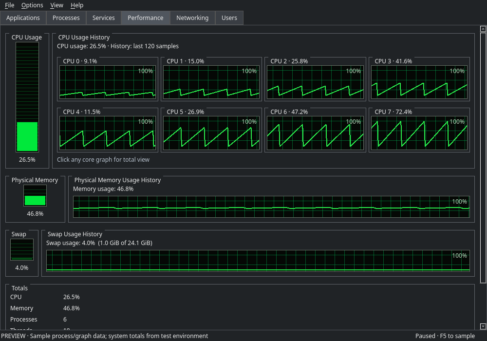
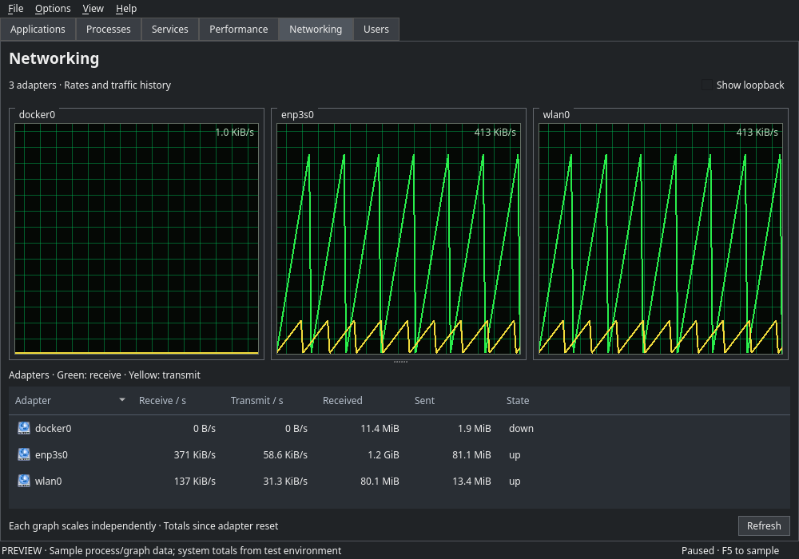

<p align="center">
  
</p>

# Linux Task Manager

A small, open-source Linux task manager inspired by the classic Windows XP
Task Manager layout. Familiar tabs, live resource graphs, and straightforward
process controls, built with Qt 6 and C++17.

The application uses its own interface and artwork. No original Windows icons,
branding, or extracted resources are included.

## Features

- **Classic tabbed layout:** Applications, Processes, Services, Performance,
  Networking, and Users.
- **Live process information:** CPU usage, memory, thread count, owner, status,
  command line, and parent/child process hierarchy.
- **Process controls:** search, sortable columns, and flat-list or tree views.
  Select a range with Shift, or individual rows with Ctrl, then choose
  **End Selected Processes**. A confirmation appears before termination.
- **Applications:** a task list for the current user. X11 window titles and
  activation use `wmctrl` when available; other sessions use a process-list fallback.
- **Users:** processes grouped by their owning account, including system users.
  Enable child processes with **View → Show processes under Users**.
- **Stable lists:** scroll position, selection, and collapsed groups survive
  refreshes, as long as the corresponding processes still exist.
- **CPU history:** click a graph to switch between total usage and individual cores.
- **Memory and swap:** live history graphs and classic vertical usage meters.
  Swap usage reflects Linux swap space.
- **Networking:** per-interface receive/transmit rates and traffic history,
  with an adaptive graph scale. Choose classic graphs or interface cards from **View**.
- **Services:** inspect local systemd services and start, stop, restart, or reload
  them with desktop authentication when required.
- **Themes:** XP Classic, Modern Light, Modern Dark, and High Contrast.
- **Saved preferences:** theme, window layout, and view settings persist between sessions.
- **Desktop shortcuts:** right-click menus and **File → Run New Task**.

## Screenshots

### Performance — per-core CPU history



### Networking — classic view



These previews use sample process and graph data; some totals come from the
preview environment.

## Install

Download this repository using **Code → Download ZIP** on GitHub and extract it,
or clone it with Git. The downloaded folder can have any name and live anywhere
you have write access.

### 1. Check binary compatibility

The `lintaskmanager` from releases is a ready-built **Linux x86_64** executable, built on
Debian 13 with Qt 6.8.2. It uses system libraries rather than bundling them.
Install the Qt 6 Widgets runtime and platform plugins supplied by your distribution.
On Debian 13:

```sh
sudo apt update
sudo apt install libqt6widgets6 qt6-qpa-plugins pkexec
```

For other distributions, architectures, or older libraries, use the source-build
instructions below to produce a binary for your machine.

### 2. Run the installer (releases)

Open a terminal in the extracted folder and run:

```sh
sh ./install.sh
```

The script installs the existing binary, launcher, and icon directly from
working directory. It does not compile anything or require a `build/` directory.
All source paths are relative to the script, so it works from another directory
or after renaming the downloaded folder. Sudo is used only to copy the files.

Only three files are installed:

| File | Location |
| --- | --- |
| Application | `/usr/bin/lintaskmanager` |
| Desktop launcher | `/usr/share/applications/lintaskmanager.desktop` |
| Application icon | `/usr/share/icons/hicolor/256x256/apps/lintaskmanager.png` |

### 3. Open the application

Find **Linux Task Manager** in GNOME's applications menu, or run:

```sh
lintaskmanager
```

Run the application as your normal user. Service actions open a separate desktop
authentication prompt when required by system policy; the application does not
collect or save passwords.

To update, download the newer release and run the installer again.

## Build from source (optional)

Use this if the supplied binary is incompatible with your machine, or if you
want to build a modified version. Install development packages first:

**Debian / Ubuntu**

```sh
sudo apt install build-essential cmake qt6-base-dev qt6-base-dev-tools pkexec
```

**Fedora**

```sh
sudo dnf install gcc-c++ cmake qt6-qtbase-devel polkit
```

**Arch Linux**

```sh
sudo pacman -S --needed base-devel cmake qt6-base polkit
```

From the extracted folder, build and replace the release binary:

```sh
cmake -S . -B build -DCMAKE_BUILD_TYPE=Release
cmake --build build --parallel 2
cp build/lintaskmanager installer/lintaskmanager
sh .installer/install.sh
```

To try it without installing, run `./build/lintaskmanager` instead.
Service controls require systemd and a desktop polkit authentication agent.

Additionally, you can also add the icon by downloading from the 'releases' and installing it the same way as described. 

## Uninstall

```sh
sudo rm -f /usr/bin/lintaskmanager \
  /usr/share/applications/lintaskmanager.desktop \
  /usr/share/icons/hicolor/256x256/apps/lintaskmanager.png
```

This removes the installed application and launcher. Your saved preferences remain.

## Troubleshooting

- **The binary reports missing libraries or an incompatible version:** install the
  runtime dependencies or build from source for your distribution.

- **CMake cannot find Qt:** install the development packages listed above, then repeat
  the source-build commands.
- **Service actions cannot authenticate:** check that `pkexec` and a desktop polkit
  agent are available. Services also require a systemd-based system.
- **Window titles or switching are unavailable:** install the optional `wmctrl`
  package for X11. Wayland may restrict access to other applications' windows.
- **The launcher is not visible yet:** try `lintaskmanager` in a terminal and sign
  out and back in if the desktop menu has not refreshed.

## License

[BSD Zero Clause License](LICENSE). The source and the new application icon are
included in this repository. Build files are generated locally and ignored by Git.
